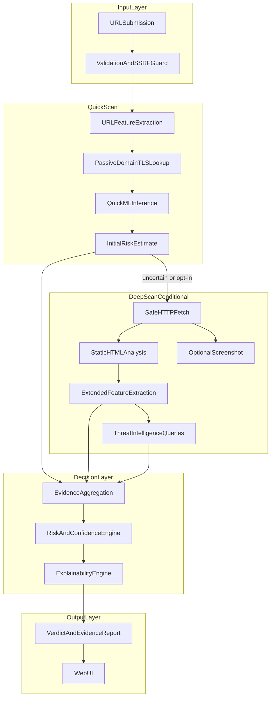
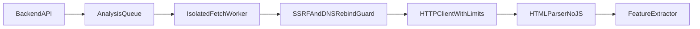

# 06 — System Architecture

> **Related:** [07-threat-model.md](07-threat-model.md) · [12-risk-engine.md](12-risk-engine.md) · [14-api-contract.md](14-api-contract.md)

High-level architecture, analysis layers, and end-to-end data flow.

---

## Proposed System Capabilities



---

## Analysis Layers

### Layer 1 — URL Analysis (Core)

| Signal | Justification | Caveat |
|---|---|---|
| URL/domain/path length | Long URLs common in phishing | High false positives alone |
| Subdomain count | Excessive subdomains suspicious | CDN patterns exist |
| Digit/special char ratio | Obfuscation indicator | Weak alone |
| Suspicious keywords | Semantic bait | Common on legit sites |
| Brand impersonation in domain | Typosquat detection | Requires brand list |
| IP-based URL | Often malicious | Not always |
| Punycode/IDN | Homograph attacks | Rare but important |
| Shannon entropy | Random domain detection | Needs threshold tuning |
| @ symbol, hex encoding, port abuse | Obfuscation | Justified |

**Recommendation:** ~12–18 URL features. Prune by ablation in Experiment A. Full list in [09-feature-specification.md](09-feature-specification.md).

### Layer 2 — Domain Intelligence (Core)

| Signal | Obtainable? | Notes |
|---|---|---|
| Domain age | Yes (WHOIS/RDAP) | Missing for some TLDs |
| Registrar | Yes | Weak signal alone |
| DNS A/AAAA/MX/NS | Yes | Infrastructure hints |
| Nameserver reputation | Partial | Via heuristics |
| Domain in Tranco top-1M | Yes | Legitimacy prior |
| WHOIS privacy flag | Yes | Weak |

### Layer 3 — Network/TLS (Core)

| Signal | Notes |
|---|---|
| HTTPS availability | Required check; absence increases risk |
| Cert validity/expiry | Invalid cert = suspicious |
| Cert issuer | Weak alone |
| Cert domain mismatch | Strong signal |
| Self-signed cert | Strong signal |
| Redirect count and cross-domain redirects | Cloaking indicator |
| Final URL vs submitted URL | Destination mismatch |

**Critical:** Valid HTTPS **must not** reduce risk automatically.

### Layer 4 — Website Analysis (Core for deep scan)

| Signal | Method |
|---|---|
| Password input fields | HTML parser |
| Form action to external domain | DOM parse |
| Hidden input count | DOM parse |
| iframe count | DOM parse |
| External script domains | Parse src attributes |
| Page title brand mismatch | String similarity vs domain |
| Meta refresh redirect | HTML parse |
| Suspicious TLD in external resources | Heuristic |

**Not in core:** JS behavior analysis, dynamic DOM inspection.

### Layer 5 — Visual Analysis (Optional)

- Screenshot for user inspection and demo value.
- No automated visual classification in v1.

### Layer 6 — External Threat Intelligence (Recommended)

See [11-external-intelligence.md](11-external-intelligence.md).

---

## Components

| Component | Responsibility |
|---|---|
| **Web Frontend** | URL submission, results, simple/technical views |
| **API Gateway / Backend** | Validation, orchestration, rate limiting |
| **URL Analysis Engine** | Lexical feature extraction |
| **Domain Intelligence Service** | DNS, WHOIS/RDAP, Tranco lookup |
| **Safe Fetch Service** | HTTP fetch, redirect tracking, isolation |
| **HTML Analysis Engine** | Form/title/content heuristics |
| **ML Inference Service** | Load model, predict, SHAP |
| **Threat Intel Adapter Layer** | Provider plugins |
| **Evidence Aggregator** | Collect normalized evidence items |
| **Risk & Confidence Engine** | Fusion, thresholds, conflict detection |
| **Explainability Engine** | Generate structured explanations |
| **Cache** | TI and DNS result caching |
| **Storage** | Analysis metadata, model artifacts |
| **Job Queue** | Async deep scans |

### Deployment view (student-realistic)

Single Docker Compose stack: frontend + API + worker + Redis cache + SQLite/PostgreSQL.

---

## End-to-End System Flow

```text
User
 ↓
URL Submission (+ optional Deep Scan flag)
 ↓
Validation & Normalization (scheme, length, punycode decode)
 ↓
SSRF Guard (block internal/reserved targets)
 ↓
Quick Scan:
   URL Features → Passive Domain/DNS → TLS probe (if feasible)
   → Quick ML inference → Initial risk estimate
 ↓
Decision Gate:
   IF risk in uncertain band OR deep_scan_requested:
     → Safe HTTP Fetch → Redirect analysis → HTML parse
     → Extended features → TI queries (parallel, timeout-bounded)
     → Optional screenshot
   ELSE:
     → Skip active fetch
 ↓
Evidence Aggregation (normalize all items)
 ↓
Risk & Confidence Engine
 ↓
Explainability Engine
 ↓
Persist metadata (minimal) → Return result
 ↓
UI: Simple verdict + expandable technical evidence
```

---

## Website Investigation Architecture



See [07-threat-model.md](07-threat-model.md) for full security controls.
