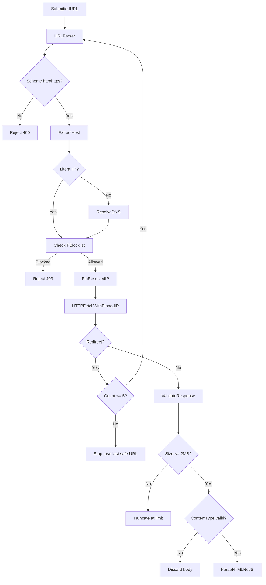

# 07 — Threat Model

> **Related:** [06-system-architecture.md](06-system-architecture.md) · [16-testing-strategy.md](16-testing-strategy.md) · [04-project-constitution.md](04-project-constitution.md)

STRIDE analysis, SSRF controls, and safe fetch worker security design.

---

## Scope

This threat model covers:

- User-submitted URL analysis pipeline
- Safe HTTP fetch worker
- External threat intelligence API integration
- Backend API exposed to users

Out of scope: frontend XSS (standard React protections), infrastructure provider security.

---

## Assets

| Asset | Sensitivity | Impact if Compromised |
|---|---|---|
| Backend server and internal network | High | SSRF to internal services, data exfiltration |
| TI provider API keys | Medium | Quota exhaustion, unauthorized usage |
| User-submitted URLs | Medium | Privacy leak if logged insecurely |
| ML model artifacts | Low | Model theft (low impact for student project) |
| Analysis metadata database | Low | Exposure of analyzed URL hashes |

---

## Threat Actors

| Actor | Motivation | Capability |
|---|---|---|
| Malicious URL submitter | SSRF to internal services, resource exhaustion | Can craft arbitrary URLs |
| Phishing page operator | Exploit fetch worker via malicious content | Controls page content served to worker |
| API abuser | Exhaust quotas, denial of service | Automated requests |
| Curious user | Privacy probing | Submits sensitive URLs |

---

## STRIDE Analysis

### Spoofing

| Threat | Target | Mitigation |
|---|---|---|
| TI API response spoofing (MITM) | Fetch worker / API | HTTPS only for all external calls; verify TLS |
| DNS spoofing redirecting fetch to internal IP | Fetch worker | Resolve DNS before connect; pin resolved IP; reject private IPs |

### Tampering

| Threat | Target | Mitigation |
|---|---|---|
| Malicious HTML/JS altering fetch worker | Fetch worker | No JS execution; parse HTML only; content-type validation |
| Redirect chain tampering (open redirect abuse) | Fetch worker | Validate each redirect hop against SSRF guard; max 5 hops |
| Cache poisoning (fake TI results) | Redis cache | Cache key includes URL hash + provider; TTL limits exposure |

### Repudiation

| Threat | Target | Mitigation |
|---|---|---|
| User denies submitting URL | API | Log analysis ID, timestamp, source IP (hashed) |
| No audit trail for analysis decisions | Risk engine | Persist evidence summary with analysis record |

### Information Disclosure

| Threat | Target | Mitigation |
|---|---|---|
| SSRF reveals internal service data | Internal network | Block all private IP ranges; isolated fetch network |
| Submitted URLs logged insecurely | User privacy | Store URL hash by default; configurable retention |
| TI API keys in logs/errors | API keys | Never log secrets; environment variables only |
| Error messages reveal internal paths | API | Generic error messages to users; detailed logs server-side |

### Denial of Service

| Threat | Target | Mitigation |
|---|---|---|
| Resource exhaustion via huge response | Fetch worker | Max response size 2 MB; timeout 10s per hop |
| Slowloris / slow response | Fetch worker | Hard timeout; abort connection |
| Redirect loop (infinite redirects) | Fetch worker | Max 5 redirects |
| API abuse (rapid submissions) | Backend API | Rate limit 10 scans/min/IP |
| Concurrent deep scan exhaustion | Worker queue | Max 3 concurrent deep scans; queue limit |
| TI API quota exhaustion | External APIs | Cache results; tiered provider usage |

### Elevation of Privilege

| Threat | Target | Mitigation |
|---|---|---|
| Fetch worker accesses internal Docker network | Internal services | Separate Docker network; no route to db/redis |
| SSRF to cloud metadata (169.254.169.254) | Cloud credentials | Block link-local and metadata IP ranges |
| DNS rebinding to access internal after validation | Internal network | Pin IP at connect time; re-validate on redirect |

---

## SSRF Protection Architecture



---

## IP Blocklist

All of the following must be blocked at validation AND at each redirect hop:

| Range | CIDR | Reason |
|---|---|---|
| Loopback | `127.0.0.0/8`, `::1/128` | Localhost access |
| Private Class A | `10.0.0.0/8` | RFC1918 |
| Private Class B | `172.16.0.0/12` | RFC1918 |
| Private Class C | `192.168.0.0/16` | RFC1918 |
| Link-local | `169.254.0.0/16`, `fe80::/10` | AWS metadata, link-local |
| Cloud metadata | `169.254.169.254` | AWS/GCP/Azure metadata |
| Broadcast | `255.255.255.255` | Broadcast |
| Unspecified | `0.0.0.0` | Unspecified |
| IPv6 unique local | `fc00::/7` | IPv6 private |
| IPv6 loopback | `::1` | IPv6 localhost |

### IP encoding bypass prevention

Also block URLs using:

- Decimal IP: `http://2130706433/` (= 127.0.0.1)
- Hex IP: `http://0x7f000001/`
- Octal IP: `http://0177.0.0.1/`
- IPv6 mapped IPv4: `http://[::ffff:127.0.0.1]/`
- Short forms: `http://127.1/`

Normalize all IP representations before blocklist check.

---

## DNS Rebinding Protection

1. Resolve hostname to IP **before** establishing connection
2. Validate resolved IP against blocklist
3. Connect to the **pinned IP**, not the hostname (prevent TOCTOU)
4. On redirect to new hostname: re-resolve and re-validate
5. Do not cache DNS results across requests (or use very short TTL)

---

## Fetch Worker Isolation

| Control | Implementation |
|---|---|
| Separate Docker container | `fetch-worker` service |
| Isolated network | `fetch-net` with internet egress only |
| No internal service access | No route to `db`, `redis`, `api` networks |
| No JavaScript execution | Static HTML parse only (BeautifulSoup) |
| No file download execution | Discard non-HTML content types |
| Identifiable User-Agent | `PhishoraBot/1.0 (+https://phishora.example.com/bot)` |
| Request method | GET only; no POST/PUT to submitted URLs |
| Cookie handling | Do not send or store cookies |
| Authentication | Do not follow auth prompts or submit credentials |

---

## Content Handling

| Content-Type | Action |
|---|---|
| `text/html` | Parse for features |
| `text/plain` | Parse if small; limited features |
| `application/xhtml+xml` | Parse as HTML |
| `application/json` | Discard (not a web page) |
| `application/octet-stream` | Discard immediately |
| `application/pdf`, images, etc. | Discard immediately |
| Missing Content-Type | Sniff first bytes; discard if not HTML-like |

Maximum response body: **2 MB** (truncate or abort).

---

## Redirect Handling

| Rule | Value |
|---|---|
| Maximum redirects | 5 |
| Cross-domain redirects | Allowed but each hop validated |
| Scheme downgrade (https → http) | Flag as risk evidence; continue |
| Scheme upgrade (http → https) | Allow |
| Redirect to IP literal | Validate against blocklist |
| Meta refresh redirect | Detect in HTML; do not follow automatically (flag as evidence) |

---

## Malicious Content Risks

| Risk | Mitigation |
|---|---|
| HTML with embedded JavaScript | Parse only; never execute |
| `<script>` tags | Ignored during feature extraction |
| Event handlers (`onclick`, etc.) | Not executed |
| External resource loading | Do not fetch linked resources (CSS, JS, images) |
| Polyglot files | Content-type + size limits |
| Zip bombs / compressed responses | Limit decompressed size to 2 MB |
| HTML entity expansion (billion laughs) | Limit parsed DOM node count (e.g., 10,000 nodes) |

---

## API Security

| Control | Implementation |
|---|---|
| Input validation | Pydantic models; URL length ≤ 2048 |
| Rate limiting | 10 requests/min/IP (configurable) |
| Error handling | Generic messages to client; no stack traces |
| CORS | Restrict to frontend origin |
| API keys | Environment variables; never in code/logs |
| HTTPS | Enforce in production deployment |

---

## Security Testing Requirements

All items in [16-testing-strategy.md](16-testing-strategy.md#security-testing) must pass before deployment.

Minimum SSRF test suite:

```
test_block_localhost
test_block_private_class_a
test_block_private_class_b
test_block_private_class_c
test_block_link_local
test_block_cloud_metadata
test_block_decimal_ip
test_block_hex_ip
test_block_ipv6_loopback
test_redirect_to_internal_ip
test_redirect_chain_exceeds_limit
test_response_size_limit
test_timeout_enforcement
test_invalid_scheme
test_dns_rebinding_pinning
```

---

## Incident Response (Minimal)

If SSRF vulnerability discovered:

1. Disable fetch worker immediately
2. Review logs for exploitation attempts
3. Patch and re-run full security test suite
4. Document in decision log

---

## Security Review Checklist

Before deployment:

- [ ] SSRF test suite passes (100% block rate on test payloads)
- [ ] Fetch worker runs in isolated Docker network
- [ ] No API keys in repository or logs
- [ ] Rate limiting enabled
- [ ] Error messages do not leak internal information
- [ ] Redirect validation tested
- [ ] Response size limits enforced
- [ ] DNS rebinding manual test documented
